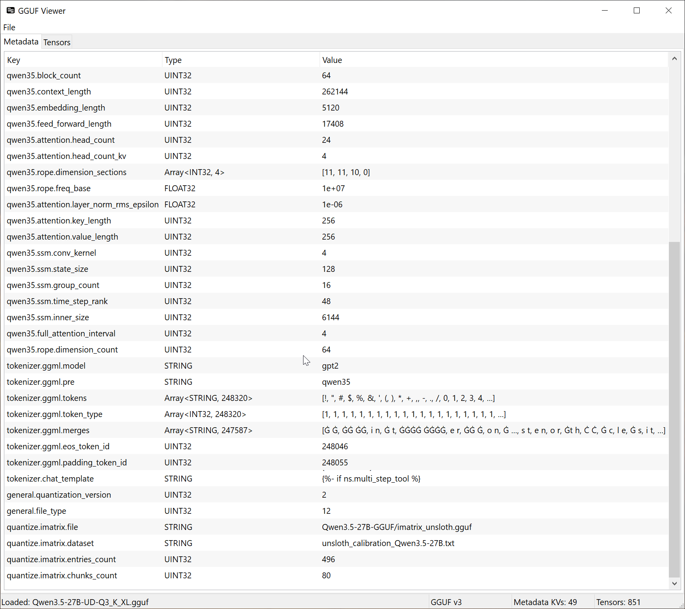
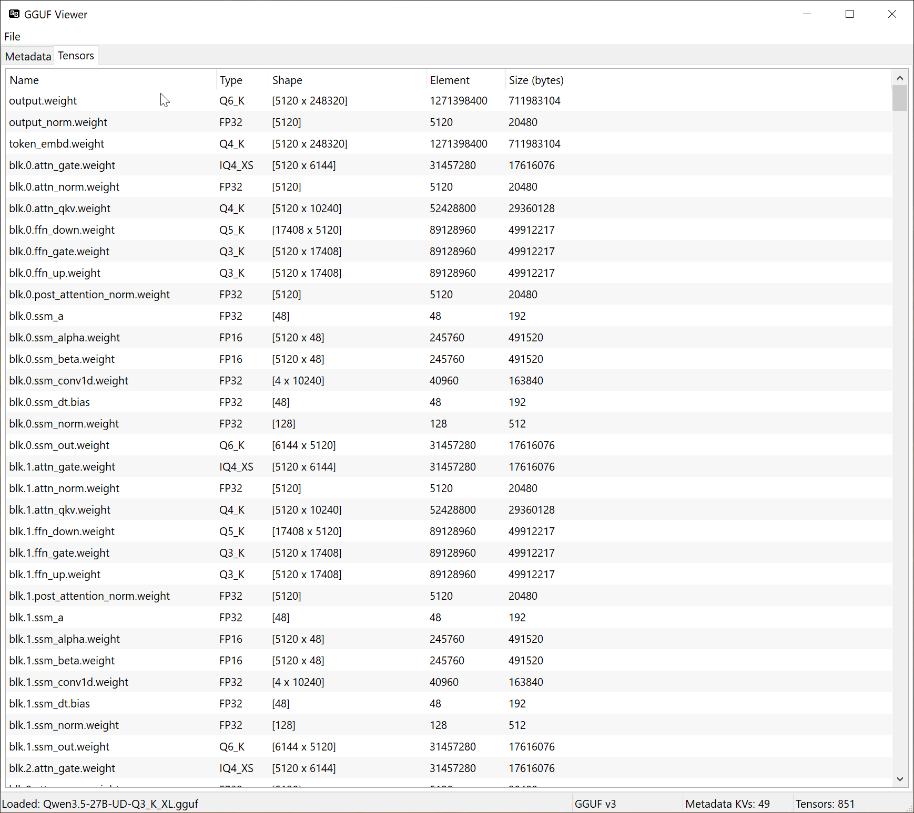

# GView

A lightweight, standalone visual GGUF metadata and tensor inspector. It functions similarly to standard Python-based inspectors but requires zero dependencies, no Python runtime, and runs completely self-contained.

## Features

- **Standalone Binary:** No Python, `pip`, or heavy dependencies required.
- **Fast Parsing:** Reads **only** the header and metadata arrays from the GGUF file instantly without reading the heavy tensor data weights into memory.
- **Drag & Drop:** Drop any `.gguf` file directly into the interface to parse it immediately.
- **Cross-Platform:** Built natively using C++ and wxWidgets for Windows, macOS, and Linux.

---

## Screenshots

*(Drag and drop a GGUF file to view its structure)*




---

## Compilation & Setup

### Requirements
- C++20 compliant compiler (MSVC on Windows, GCC/Clang on Linux)
- CMake 3.20+ (Required for Presets support)
- Ninja (Recommended)

### Building (Using CMake Presets)

```bash
# 1. Configure the project
cmake --preset build-release

# 2. Build the project
cmake --build build-release